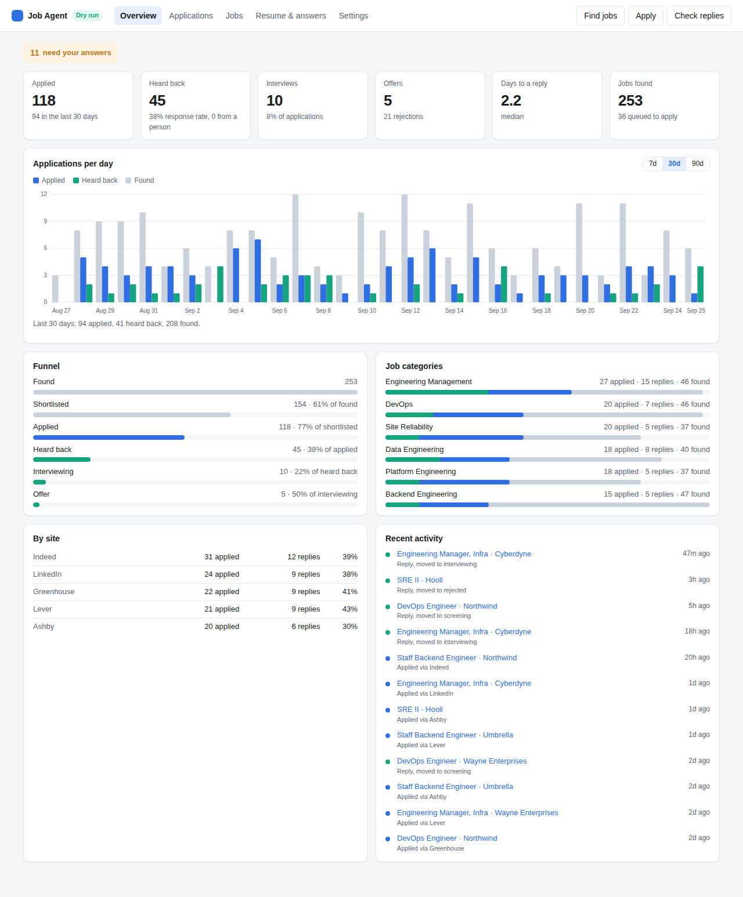

# Job Agent

An agent that finds jobs across the boards, tailors a resume for each posting
from facts you actually supplied, submits the application, watches for replies,
and reports the lot on a dashboard.

Architecture and the reasoning behind each decision:
**[Auto-Apply Agent Blueprint](https://claude.ai/artifact/CMmq6LQBy6Dd1ibdnbj3y2)**.

## Where this is up to

| Phase | What it covers | State |
|---|---|---|
| 1 | Scaffold, database schema, resume intake, fact base | done |
| 2 | Discovery, dedupe, enrichment, scoring | done |
| 3 | Tailoring and PDF rendering | done |
| 4 | Submission, on career-page boards, off by default | done |
| 4b | LinkedIn Easy Apply and Indeed's own application | done |
| 5 | Response tracking | done |
| 6 | Dashboard and scheduling | **this branch** |

## The fact base

The idea the rest of the project rests on: your resume is parsed into
individually addressable facts — one per role, project, skill, degree — and the
skills and keywords you type in are stored the same way, marked `user_added`.

When phase 3 tailors a resume for a posting, it may select, reorder and rephrase
from that set and nothing else. A claim with no fact behind it never reaches a
PDF. Adding a keyword is you asserting it, not the model deciding it may.

A never-claim list sits alongside it: technologies you have not used. A fact or
keyword naming one is refused at the point you add it, not at render time.

## Running it

```bash
python -m venv .venv && source .venv/bin/activate
pip install -e ".[dev]"
cp .env.example .env
jobagent serve                # the dashboard, at http://127.0.0.1:8000
```

PDF rendering uses WeasyPrint, which needs Pango and Cairo on the machine
(`brew install pango` on macOS, `apt install libpango-1.0-0 libpangoft2-1.0-0`
on Debian and Ubuntu). Everything else is pure Python.

### Which model bill

Every model call goes through one seam (`llm/backend.py`) with two backends
behind it, picked by `JOBAGENT_LLM_BACKEND` in `.env`:

| Setting | What it uses | When to pick it |
|---|---|---|
| `claude-code` | The `claude` command line, on your Claude subscription login | You already pay for Claude and the agent runs on a machine where you are logged in |
| `api` | The Claude API with `ANTHROPIC_API_KEY`, metered per token | Headless or scheduled runs on a box with no login, or you want per-run cost figures |
| `auto` (default) | The API if a key is set, otherwise `claude` if it is installed | You do not want to think about it |

### Submission settings

| Setting | Default | What it does |
|---|---|---|
| `JOBAGENT_APPLY_MODE` | `dry_run` | `dry_run` fills and stops, `review` parks it for approval, `auto` submits |
| `JOBAGENT_DAILY_APPLY_CAP` | `20` | Submissions in any trailing 24 hours, in `auto` mode |
| `JOBAGENT_EASY_APPLY_DAILY_CAP` | `10` | LinkedIn's and Indeed's own caps, each, inside the daily one |
| `JOBAGENT_APPLY_DELAY_SECONDS` | `45` | The pause between submissions, jittered |
| `JOBAGENT_APPLY_MODEL_ANSWERS` | `true` | Let the model draft answers to open questions, from the fact base |
| `JOBAGENT_HEADLESS` | `true` | `false`, or `--headed`, shows the browser window |
| `JOBAGENT_BROWSER_EXECUTABLE` | unset | A Chromium binary, when Playwright's own is not there |

### Response tracking settings

| Setting | Default | What it does |
|---|---|---|
| `JOBAGENT_IMAP_HOST` | unset | The mailbox to read replies from. Unset means response tracking does nothing |
| `JOBAGENT_IMAP_PORT` | `993` | |
| `JOBAGENT_IMAP_USER` | unset | |
| `JOBAGENT_IMAP_PASSWORD` | unset | An app password for Gmail and Outlook, not your account password |
| `JOBAGENT_IMAP_FOLDER` | `INBOX` | A dedicated folder, if you filter application mail into one |
| `JOBAGENT_INBOX_LOOKBACK_DAYS` | `30` | How far back the first poll reads |
| `JOBAGENT_INBOX_MODEL_TRIAGE` | `true` | Ask the model about replies the phrase rules cannot read |
| `JOBAGENT_INBOX_MIN_CONFIDENCE` | `0.6` | Below this a reply is logged but moves no status |

For the subscription route: install Claude Code, run `claude auth login`
once, and leave `ANTHROPIC_API_KEY` unset. The agent shells out to
`claude -p` with a JSON schema and never sees your login token. Usage counts
against the subscription's limits, so a large overnight run can hit them.

### Finding jobs

Tell it what to look for, then run a pass:

```bash
jobagent criteria --title "Software Engineer" --title "Backend Engineer" \
    --location Remote --keyword python --keyword aws \
    --board greenhouse:stripe --board lever:netflix:Netflix --site indeed
jobagent discover             # or POST /api/runs/discover from the dashboard
```

A run searches every company board in the criteria (Greenhouse, Lever and
Ashby publish their postings as public JSON with full descriptions) and, for
each title and location pair, the aggregator sites through JobSpy (Indeed,
LinkedIn and the rest, by scraping). What comes back goes through:

1. **Dedupe.** A posting's id is a hash of its cleaned URL, title and company,
   and the URL is unique on its own, so the same job seen on two boards lands
   once and a re-listed one cannot be applied to twice.
2. **Enrichment.** A posting that arrived as a snippet gets its page fetched
   and the full description pulled from JSON-LD, then known selectors per
   platform, then (only with `--enrich-with-model`) the model.
3. **Rules.** A deterministic 0 to 100 score on title, salary, location and
   keyword overlap with your fact base, with hard rejects for excluded terms,
   blacklisted companies and salary below your floor. Free, runs on
   everything, and the reason for each score is stored with the job.
4. **Model tiering.** Rule survivors go to the model in batches against your
   profile, which is the cached prefix of every call. Each comes back with a
   tier (1 strong, 2 good, 3 stretch, 4 not a fit), a fit score, a category
   and a one-line reason. Tier at or under `max_tier` is queued for phase 4;
   the rest is skipped, reason attached.

Each stage reads its input back from the database, so a run that dies half
way strands nothing. Without a usable model backend the run still completes
and the survivors wait, marked pending, for the next one.

### Tailoring the resume

```bash
jobagent tailor --queued          # every queued job that has no resume yet
jobagent tailor <job id>          # or one job, from the dashboard's list
```

For each job this makes a **variant**: a resume built from your fact base for
that posting, rendered to an ATS-safe PDF under `data/variants/`, with a cover
letter alongside. The model does not write the resume. It writes a plan: which
facts to show, in what order, and how each is phrased, and every bullet cites
the fact it came from. Employers, titles and dates are rendered from the facts
themselves, so the model cannot touch them.

Before anything is rendered, a validator checks the plan without a model:

- every cited fact exists and is active, and sits in the right section;
- no bullet names a technology, tool or acronym its fact does not state, and
  no number appears that the fact does not carry;
- nothing on your never-claim list appears anywhere;
- the cover letter is held to the same rule against the whole fact base.

A plan that fails goes back to the model once with the exact objections. A
second failure is kept as a *rejected* variant with its issues, so you can see
what the guardrail caught, and nothing is rendered. A keyword-coverage gate
applies the same discipline to usefulness: a variant that mentions fewer of the
posting's keywords than your uploaded resume did is sent back too.

### Applying

```bash
jobagent apply --queued                  # fill the forms, stop at the button
jobagent apply <job id> --headed         # watch it happen in a real window
jobagent applications                    # what is filled, and what it waits on
jobagent answer 7 work_authorization=Yes # answer once; it is kept for next time
jobagent approve 7                       # send the one you have read
jobagent apply --queued --submit         # send them without reading them first
```

**Nothing is sent unless you ask for it.** The default mode is `dry_run`: the
agent opens the form, fills every field it can, takes a screenshot to
`data/screenshots/` and stops at the submit button. `review` does the same and
parks the application for your approval. Only `auto` presses the button, and
only under a daily cap with a jittered pause between submissions.

Greenhouse, Lever, Ashby, LinkedIn Easy Apply and Indeed's own application
have a handler each, and anything else falls to a generic filler that works
from what the page shows. The
generic one refuses to fill a form that is not an application: a careers page's
search box is a form too.

What goes on the form comes from three places, in order: your contact details
and the tailored resume for that job, then the answer bank, then the model, and
the model's answers are held to the same fact base the resume is. Questions
about work authorization, sponsorship, salary, start dates, relocation and the
like are **never guessed**. They come back as questions:

```
$ jobagent apply --queued
mode dry_run, considered 3, dry run 2, needs input 1
abc123: dry_run via greenhouse, 14 fields filled, application 4, data/screenshots/abc123-1.png
def456: needs_input via lever, 11 fields filled
    ask: Will you now or in the future require sponsorship? [visa_sponsorship]

$ jobagent answer 5 visa_sponsorship=No
def456: dry_run via lever, 12 fields filled, application 5
```

An answer is stored under its own key, so the next form that asks the same
thing, on any site, is filled without asking you again.

An application is only ever recorded as **submitted** when the page itself
confirmed it. A button that was pressed with neither a confirmation nor an error
is `unconfirmed`, and the job waits for you to look rather than being tried
again. A captcha, a login wall or a "we emailed you a code" prompt is `blocked`,
with what to do about it. Every attempt is kept, so you can read a dry run
before changing the mode.

### LinkedIn and Indeed

Easy Apply and Indeed's application only exist for someone signed in, so sign
in once, on your own machine:

```bash
jobagent login linkedin          # a browser window opens at LinkedIn's sign-in page
jobagent login indeed
jobagent login linkedin --status # still good?
jobagent login linkedin --forget # delete it
```

You sign in on the site's own page, two-step code included. **Your password is
never seen or kept.** What is kept is the site's cookies, in
`data/sessions/<site>.json`, readable by your user only (`data/` is not in
git). Every apply run loads them. Signing out of the site, or changing the
password, ends it; run `login` again.

Both sites apply in steps: contact details, resume, the employer's questions,
review. The agent reads one step at a time, leaves what the site filled in from
your profile as it is, uploads the resume tailored for the job, answers the
rest the same way as any other form, and moves on until the Submit button. It
stops, and closes the form unsent (LinkedIn: Dismiss, then Discard, so no draft
is left in your account), when:

- you are not signed in (`blocked`, with the `login` command to run);
- the posting applies on the company's site instead (`blocked`; add that site as
  a career-page job);
- a question has no answer on file (`needs_input`, as with any form);
- a step will not accept an answer, or Next does nothing (`blocked`, with the
  site's message and a screenshot);
- there is no Submit after 12 steps (`failed`).

In `auto` mode each of the two sites has its own cap, 10 a day by default, on
top of the overall one. See [the warning below](#before-you-turn-submission-on)
before turning it on.

### Playwright

Submission drives a real Chromium through Playwright. Once, after installing:

```bash
playwright install chromium
```

If Chromium lives somewhere else on your machine, point at it with
`JOBAGENT_BROWSER_EXECUTABLE`.

Tests and linting:

```bash
pytest
ruff check . && ruff format --check .
```

Parsing a resume costs one model call. Re-uploading a byte-identical file
returns the existing record instead of parsing it again.

### Tracking replies

```bash
jobagent inbox                      # read the mailbox and record what came back
jobagent inbox --dry-run            # read and classify, record nothing
jobagent inbox --list               # the log of everything read so far
jobagent inbox --list --unmatched   # what could not be filed automatically
jobagent inbox --attach 12=3 --status screening
```

Set the IMAP settings above and the poller reads the mailbox, works out which
application each reply belongs to, reads what it says, and appends it to that
application's event log. The mailbox is opened read-only: nothing is sent,
moved, deleted or even marked read.

Matching has no thread id to follow, so it weighs several weak signals — the
sender's domain against the company's, the company's name in the sender's
display name or the subject, the job's title in either — and refuses to file
anything it is not sure about. Those land in the log unmatched, and
`--attach MESSAGE=APPLICATION` is how you place one by hand.

Reading a reply is rules first: a list of the phrases an applicant tracking
system actually sends, specific enough that a hit is close to decisive. What
they cannot read goes to the model, and a reply nobody is confident about is
recorded as `unknown` and moves no status. The asymmetry is deliberate — a
missed interview invitation costs you a look in your own inbox, a wrong
rejection costs you the interview.

A reply only ever moves an application **forward**: an interview invitation
after a rejection is kept as a note, not a reversal. `rejected` and `withdrawn`
end an application from anywhere.

### The dashboard



`jobagent serve` and open http://127.0.0.1:8000. It is a plain page served by
the same process as the API: no build step, no account, nothing loaded from
anywhere else, light and dark to match your system.

- **Overview**: applied, heard back (and the response rate), interviews, offers,
  the median days to a reply, and jobs found; applications, replies and new
  jobs per day over 7, 30 or 90 days; the funnel from found to offer; each job
  category with what was found, applied to and answered; each site's response
  rate; and the latest submissions and replies. Anything waiting on you (a
  question to answer, an application to approve, one to check) is at the top.
- **Applications**: every application by status. Open one to see what went on
  the form, the screenshot, its history and the page's own words; answer the
  question it is stuck on (saved for every later form), submit one a dry run
  left at the button, or record an interview, offer or rejection.
- **Jobs**: what discovery found, by status and score; queue, skip or tailor one.
- **Resume & answers**: upload the resume, add skills you have, switch facts
  off, keep the never-claim list, read the answer bank.
- **Settings**: LinkedIn and Indeed sign-in status, the submission mode and
  caps, and what to search for.

The buttons at the top run a search, an apply pass (in the configured mode;
it asks first when that mode is `auto`) and a mailbox check.

A **response** is any reply filed against the application, or a status you or
the inbox moved it to. An automatic "we received your application" counts as a
reply; the "Heard back" card also says how many replies were more than that. Days follow your browser's time zone.

### Running on a schedule

```bash
jobagent run              # one cycle: find, tailor, apply, read replies
jobagent run --every 6    # a cycle about every 6 hours, until Ctrl-C
jobagent run --skip apply # everything but applying
```

Each step works on what the step before it left, and a step that fails is
reported while the rest still run. Applying follows `JOBAGENT_APPLY_MODE`, so a
scheduled run in the default mode fills forms and sends nothing. The daily caps
and the jittered pause hold across cycles. To run it from cron instead of
keeping a terminal open:

```cron
15 */6 * * *  cd /path/to/AI-Agent-Jobs- && .venv/bin/jobagent run >> data/cycle.log 2>&1
```

## API

| Method | Path | What it does |
|---|---|---|
| `POST` | `/api/resume` | Upload a `.pdf`, `.docx`, `.txt` or `.md` resume and parse it into facts |
| `GET` | `/api/resume` | The resume currently on file |
| `GET` | `/api/facts` | The fact base. Filter by `kind`, `source`, `include_inactive` |
| `POST` | `/api/facts` | Add one fact |
| `POST` | `/api/facts/keywords` | Bulk-add skills or keywords |
| `PATCH` | `/api/facts/{id}` | Deactivate or restore a fact |
| `GET`/`POST`/`DELETE` | `/api/never-claim` | The never-claim list |
| `GET` | `/api/answers` | The answer bank, for form filling in phase 4 |
| `GET`/`PUT` | `/api/search-criteria` | What to search for: titles, locations, keywords, boards, thresholds |
| `GET` | `/api/jobs` | Discovered jobs, best first. Filter by `status`, `min_score`, `source` |
| `GET` | `/api/jobs/counts` | How many jobs in each status |
| `GET`/`PATCH` | `/api/jobs/{id}` | One job; `PATCH` to queue or skip it by hand |
| `GET` | `/api/runs` | Past discovery runs with their counts and token use |
| `POST` | `/api/runs/discover` | Start a run in the background; `?wait=true` returns the report |
| `POST` | `/api/jobs/{id}/tailor` | Tailor the resume to this job now; returns the variant, ready or rejected |
| `GET` | `/api/jobs/{id}/variants` | Every variant made for this job |
| `GET` | `/api/variants` | Recent variants across jobs |
| `GET` | `/api/variants/{id}` | One variant: plan, coverage, issues, cover letter |
| `GET` | `/api/variants/{id}/pdf` | The rendered PDF |
| `GET` | `/api/variants/{id}/cover-letter` | The cover letter as plain text |
| `POST` | `/api/apply` | Start an apply pass; `?wait=true` returns the report |
| `GET` | `/api/apply/last` | The last apply pass's report |
| `GET` | `/api/applications` | Applications, newest first. Filter by `status` |
| `GET` | `/api/applications/counts` | How many applications in each status |
| `GET` | `/api/applications/{id}` | One application with its attempts and events |
| `GET` | `/api/applications/{id}/screenshot` | The form as the agent left it |
| `POST` | `/api/applications/{id}/answers` | Answer what a form asked; `retry` to fill it again |
| `POST` | `/api/applications/{id}/approve` | Submit one a dry run left at the button |
| `POST` | `/api/applications/{id}/events` | Log a reply, an interview, a rejection, a note |
| `POST` | `/api/inbox/poll` | Read the mailbox once; `?wait=true` returns the report |
| `GET` | `/api/inbox/last` | The last poll's report |
| `GET` | `/api/inbox` | Everything read, newest first. Filter by `application_id`, `matched`, `label` |
| `GET` | `/api/inbox/counts` | How many messages per label, and how many unmatched |
| `POST` | `/api/inbox/{id}/attach` | File a message against an application, and move its status |
| `GET` | `/api/stats` | The dashboard's numbers: totals, per day (`days`, `tz_offset_minutes`), funnel, categories, sites |
| `GET` | `/api/activity` | The newest submissions, replies and status changes |
| `GET` | `/api/config` | The mode, caps and model route (never a key or password) |
| `GET` | `/api/sessions` | Whether LinkedIn and Indeed are signed in, and until when (never the cookies) |
| `DELETE` | `/api/sessions/{site}` | Forget a saved sign-in |

Interactive docs at `/docs` while the server is running.

## Layout

```
src/jobagent/
├── config.py           Settings, read from the environment
├── answers.py          Standing answers to application form questions
├── db/
│   ├── schema.sql      Every table, with the two invariants stated at the top
│   └── database.py     Connections (one per thread), WAL, transactions
├── llm/
│   └── backend.py      One seam for model calls: API or Claude Code subscription
├── resume/
│   ├── extract.py      File bytes to plain text
│   ├── parser.py       Text to facts, via the model
│   ├── facts.py        The fact base and the never-claim list
│   ├── profile.py      The fact base as tags and as a short profile, for scoring
│   └── intake.py       Upload, store, parse, record
├── discovery/
│   ├── criteria.py     What to search for, stored as one settings row
│   ├── sources/        Greenhouse, Lever, Ashby (public JSON) and JobSpy (scraping)
│   ├── enrich.py       Snippet to full description: JSON-LD, selectors, model
│   ├── scoring/
│   │   ├── rules.py    The free 0 to 100 pass, with reasons
│   │   └── classify.py The batched model pass that tiers the survivors
│   ├── store.py        Jobs and runs on disk; dedupe on the way in
│   └── pipeline.py     One run, stage by stage
├── tailor/
│   ├── models.py       The plan the model returns: facts to show, cited per bullet
│   ├── keywords.py     What the posting asks for; how much of it a text covers
│   ├── generate.py     The prompts and the two model calls (resume plan, letter)
│   ├── validate.py     The guardrail: nothing the facts do not state gets through
│   ├── render.py       Plan + facts to ATS-safe HTML, text and PDF (Jinja2, WeasyPrint)
│   ├── store.py        Variants on disk, ready or rejected
│   └── pipeline.py     Plan, check, gate, render, keep
├── apply/
│   ├── models.py       Form fields, the packet, the plan, what a handler reports
│   ├── answering.py    Fields to answers, from the packet, the bank, then the model
│   ├── browser/
│   │   ├── session.py  Launching Chromium; the only place Playwright is imported
│   │   ├── dom.py      Reading a form: what each control is and what it is called
│   │   └── fill.py     Putting the plan on the page, and reading what it says back
│   ├── handlers/       One per ATS (Greenhouse, Lever, Ashby) plus the generic filler;
│   │                   wizard.py is the step loop LinkedIn and Indeed share
│   ├── sessions.py     Saved LinkedIn and Indeed sign-ins: cookies only, owner-readable
│   ├── store.py        Applications and attempts on disk; status derived from events
│   └── pipeline.py     One apply pass: job, variant, packet, handler, attempt
├── inbox/
│   ├── models.py       A message, a match, a reading, and what one poll did
│   ├── mailbox.py      IMAP, read-only, and raw mail to plain text
│   ├── match.py        Which application a reply belongs to, or none
│   ├── classify.py     What it says: phrase rules first, the model on the rest
│   ├── store.py        The inbox log; the reason a mail is never read twice
│   └── poller.py       One pass: fetch, match, read, append
├── api/                FastAPI routes
├── dashboard/          The page: index.html, app.js, style.css, no build step
├── stats.py            The dashboard's numbers, derived from the tables at read time
├── cycle.py            One scheduled turn: discover, tailor, apply, inbox
└── main.py             App factory and the command line
```

Two invariants the schema enforces and the rest of the code assumes:

- **`application_events` is append-only.** An application's status is derived
  from its newest event by the `application_status` view, never written in
  place. Response rate and time-to-first-reply are computed from the gaps
  between events, and a status column overwrites that history. Phase 5 appends
  to the same log from the mailbox and writes no status of its own.
- **`resume_facts` is the only source a tailored resume may draw from.** The
  validator in `tailor/validate.py` is where that is enforced.

## Prior art

Five references informed the design, cited in the blueprint where each idea came
from: [AutoApply](https://github.com/AbhishekMandapmalvi/AutoApply),
[jobpilot](https://github.com/suxrobGM/jobpilot),
[job-pilot](https://github.com/mubashirali/job-pilot),
[AIApplyJobs](https://github.com/vivekshekharrai-del/AIApplyJobs),
[job-agent](https://github.com/lordvacuum/job-agent).

## Before you turn submission on

Automating submissions to LinkedIn, Indeed, Workday and the ATS vendors may
violate those platforms' terms of service, and can get your accounts
rate-limited or banned. Every one of the five references above carries a version
of this warning. The risk is real and it does not engineer away.

LinkedIn and Indeed carry the most risk here, since the application is made
from your own account there. Their handlers exist because you asked for them;
they are built to look like a person applying rather than to go fast: one step
at a time, your own session, 10 a day per site by default, a jittered pause
between submissions, and nothing sent until you change the mode.

This is why submission ships off. `dry_run` is the default mode, and `auto`
keeps both caps and the jittered delay on. Even then an application is only
recorded as sent when the page says so. Read a dry run and its screenshot
before you change the mode.
